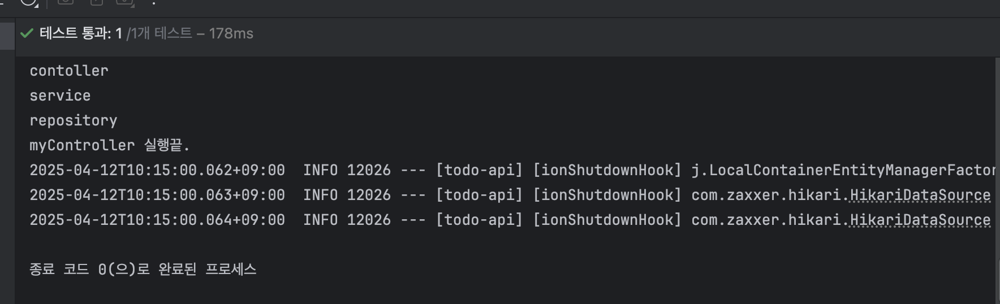

### spring 컨테이너 & bean
컨테이너 안에는 bean이라는게 있다.  
bean을 작업을 수행하는 객체 라고 보면 됨.
bean들이 작업들을 수행함.  
스프링 컨테이너 안에 bean들이 들어있고 필요한 bean을 받아서 사용.  

이때 bean을 요구하는 객체도 bean이므로 서로가 서로를 필요로 하는 구조.  

## bean 저장. 
bean을 저장하는데는 두가지 방법이 있다 .  

# 설정파일 작성(수동)
자바 클래스로 작성하고 , @Configuration를 작성하여 설정파알임을 알린다.  
bean을 작성하고 bean 객체를 생성한 이후에 Test 폴더에서 테스트 가능.  
bean 안에 직접 작성해서 Mybean같은 bean을 만들어야함.
**요청할때마다 같은 == 완전한 동일한 bean 갖다줌.**  .  
# 컴포넌트 스캔(자동)
@component 사용. , 자동으로 빈을 등록해줌.  

### 의존성 주입. 

# 의존성:
ex) 자동차를 움직이려면 반드시 필요한건 바퀴. Car클래스의 move() 메서드를 실행하려면 Wheel 객체가 필요.  
**자동차는 바퀴에 의존한다**

__마찬가지로 내가 의존하는 객체를 직접 생성하지 않고 밖에서 주입받는것__
을 **의존성 주입** 이라고 한다.  

스프링에서는 컨테이너에 저장된 빈과 빈 사이의 의존성을 프레임워크가 주입하는것을 말함.  
(통로?) 만 만들어놓으면 지가 알아서 해줍니다.  

# 이거 왜하는데요? 
객체지향 원칙중 OCP를 준수한다.  
매번 필요한 객체가 아니라 생성해준거 재사용하니깐 메모리 절약한다.  

## 의존성 주입 방법.  
# 생성자 주입
의존성이 바뀔일이 없으면 , private final로 선언.  
@Autowired 를 쓰면 생성자를 통해 빈 주입.  
@RequiredArgsConstructor를 사용하면
모든 final 필드에 대한 생성자를 자동으로 만들어주어
생성자 코드까지 생략할 수 있다.  

# 필드 주입.  
필드에 바로 @Autowired 어노테이션을 사용한다.  

### 그래서 스프링하고 빈을 어따써요?
컨트롤러 , 서비스 ,레포지 는 스프링 빈으로 등록한다.  
그리고 아마 그걸 정보 주고받고 하지않을까여?.  

